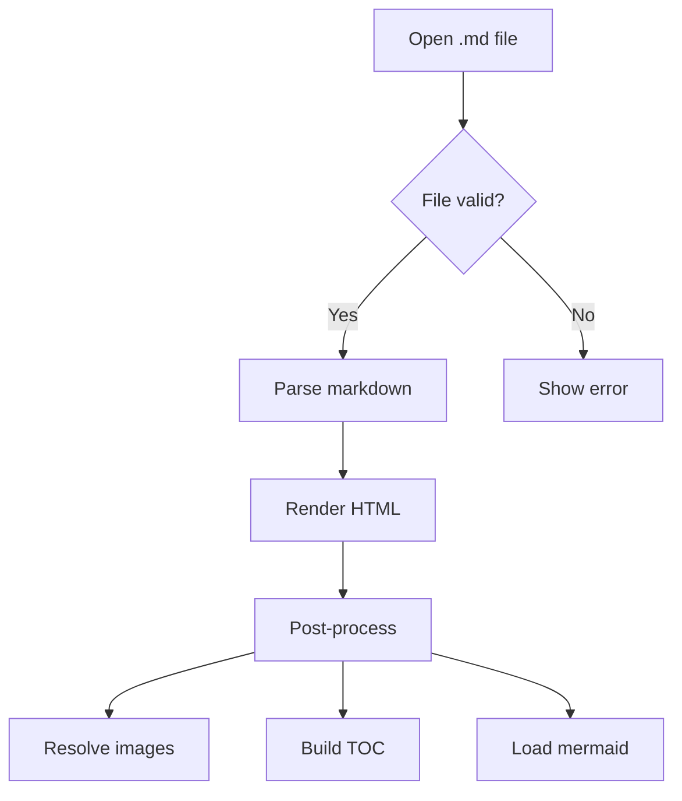
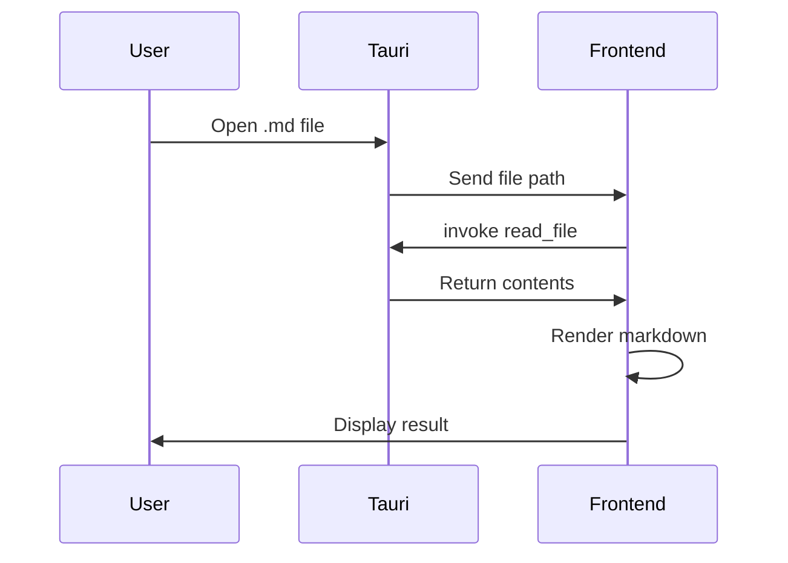

# emdee Test Document

This is a **comprehensive test** of the emdee markdown viewer, covering all supported features.

## GFM Features

### Tables

| Feature | Status | Notes |
|---------|--------|-------|
| Tables | ✅ | Full GFM support |
| Task lists | ✅ | Checkbox rendering |
| Strikethrough | ✅ | ~~like this~~ |
| Autolinks | ✅ | https://example.com |
| Footnotes | ✅ | See below[^1] |

### Task Lists

- [x] Implement markdown rendering
- [x] Add syntax highlighting
- [ ] Add mermaid support
- [ ] Ship it!

### Strikethrough

This text is ~~no longer relevant~~, but this is.

## Code Blocks

### JavaScript

```javascript
function fibonacci(n) {
  if (n <= 1) return n;
  return fibonacci(n - 1) + fibonacci(n - 2);
}

console.log(fibonacci(10)); // 55
```

### Python

```python
from dataclasses import dataclass
from typing import Optional

@dataclass
class Document:
    title: str
    content: str
    author: Optional[str] = None

    def word_count(self) -> int:
        return len(self.content.split())
```

### Rust

```rust
fn main() {
    let numbers: Vec<i32> = (1..=10).collect();
    let sum: i32 = numbers.iter().sum();
    println!("Sum: {}", sum);
}
```

### Bash

```bash
#!/bin/bash
for file in *.md; do
    echo "Processing: $file"
    wc -w "$file"
done
```

## Math (KaTeX)

Inline math: $E = mc^2$

Block math:

$$
\int_0^\infty e^{-x^2} dx = \frac{\sqrt{\pi}}{2}
$$

The quadratic formula:

$$
x = \frac{-b \pm \sqrt{b^2 - 4ac}}{2a}
$$

Matrix notation:

$$
\mathbf{A} = \begin{pmatrix} a_{11} & a_{12} \\ a_{21} & a_{22} \end{pmatrix}
$$

## Mermaid Diagrams





## Blockquotes

> "The best way to predict the future is to invent it."
> — Alan Kay

> [!NOTE]
> This is a GitHub-style admonition note.

> [!TIP]
> This is a helpful tip for the reader.

> [!IMPORTANT]
> This is important information to be aware of.

> [!WARNING]
> This is a warning about potential issues.

> [!CAUTION]
> This is a caution about dangerous consequences.

## Horizontal Rules

---

## Images

Here's where an image would go (relative path):


## Inline HTML

<details>
<summary>Click to expand</summary>

This content is hidden by default and can be expanded by clicking.

- Item one
- Item two
- Item three

</details>

## Footnotes

[^1]: This is the footnote content. It supports **formatting** and [links](https://example.com).

## Long Content for Scroll Testing

Lorem ipsum dolor sit amet, consectetur adipiscing elit. Sed do eiusmod tempor incididunt ut labore et dolore magna aliqua. Ut enim ad minim veniam, quis nostrud exercitation ullamco laboris nisi ut aliquip ex ea commodo consequat.

Duis aute irure dolor in reprehenderit in voluptate velit esse cillum dolore eu fugiat nulla pariatur. Excepteur sint occaecat cupidatat non proident, sunt in culpa qui officia deserunt mollit anim id est laborum.

### Subsection A

More content to test TOC scroll tracking. The sidebar should highlight the current heading as you scroll through the document.

### Subsection B

Even more content here. Testing that the table of contents correctly reflects the document structure with proper nesting and indentation.

### Subsection C

Final subsection with additional text to ensure proper scroll behavior throughout the entire document.

## SVG Inline

<svg width="200" height="100" xmlns="http://www.w3.org/2000/svg">
  <rect width="200" height="100" fill="#0969da" rx="10"/>
  <text x="100" y="55" text-anchor="middle" fill="white" font-family="sans-serif" font-size="18">emdee</text>
</svg>

---

*End of test document*
